# Project 01: Enterprise Active Directory Detection Lab

> **Status:** Complete — Active Directory, centralized Splunk telemetry, Sysmon, detections, dashboard panels, and scheduled alerts validated.

## Overview

This project documents an isolated enterprise-style Active Directory security monitoring lab built in VirtualBox. It combines Windows domain administration, authorized security validation, centralized log collection, endpoint telemetry, and practical detection engineering in Splunk.

The completed environment includes a domain controller, a domain-joined Windows workstation, a Kali Linux testing system, and a Splunk server. Windows Security, System, Application, and Sysmon events are forwarded to Splunk, where tested searches detect failed authentication, PowerShell execution, account changes, service installation, and scheduled-task activity.

> All testing was performed only against systems created and owned by the project author in an isolated lab.

## Objectives

- Build an isolated Windows domain environment.
- Deploy Active Directory Domain Services and DNS.
- Join a Windows workstation to the domain and validate domain authentication.
- Configure and test password and account-lockout controls.
- Perform authorized reconnaissance and validate SMB signing.
- Centralize Windows telemetry with Splunk Universal Forwarder.
- Deploy Sysmon and forward its operational log to Splunk.
- Enable additional Windows audit policies.
- Develop, test, dashboard, and alert on practical security detections.

## Lab Architecture

| System | Hostname | Purpose | Lab IP address |
|---|---|---|---|
| Windows Server | `DC01` | Active Directory Domain Services, DNS, and domain controller | `192.168.56.5` |
| Windows Workstation | `WS01` | Domain-joined endpoint and monitored host | Private lab network |
| Kali Linux | `Kali` | Authorized security testing and administration | `192.168.56.20` |
| Ubuntu/Splunk Server | `SPLUNK01` | Central log collection, searching, dashboards, and alerts | `192.168.56.10` |

## Domain Configuration

| Setting | Value |
|---|---|
| Domain | `corp.local` |
| NetBIOS name | `CORP` |
| Domain controller | `DC01` |
| Client workstation | `WS01` |
| Primary test user | Alice Johnson (`ajohnson`) |

## Active Directory Deployment and Authentication

Active Directory Domain Services and DNS were installed on `DC01`, which was promoted to the domain controller for `corp.local`. Organizational units and domain accounts were created to represent a small enterprise directory.

`WS01` was joined to the domain, and successful authentication was confirmed by signing in as `CORP\ajohnson`.

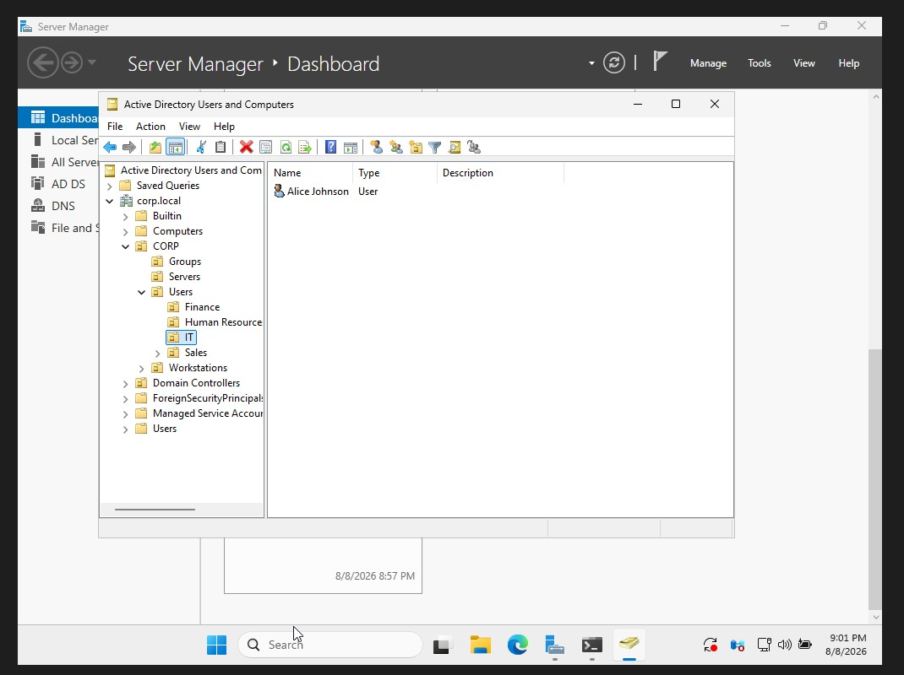

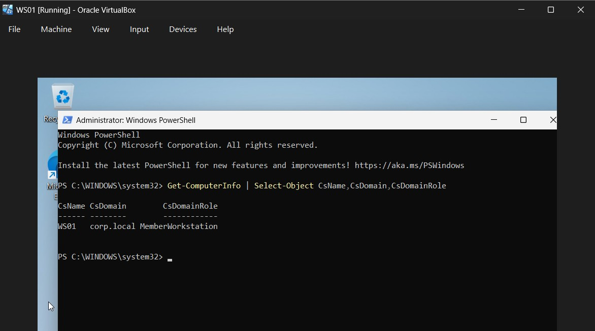

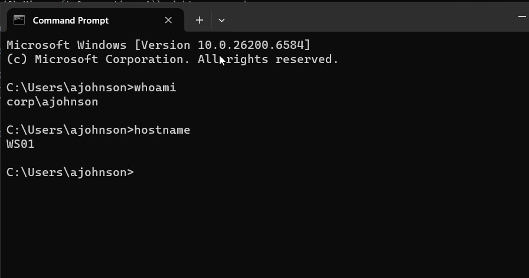

## Password and Account-Lockout Validation

The tested domain controls included:

| Control | Configured value |
|---|---|
| Lockout threshold | 5 failed authentication attempts |
| Lockout duration | 15 minutes |
| Observation/reset window | 15 minutes |
| Password complexity | Enabled |

Controlled incorrect authentication attempts against `ajohnson` generated Security Event ID `4740` on `DC01`. The event recorded both the locked account and caller computer `WS01`. The account was then restored with `Unlock-ADAccount`, and valid access was reconfirmed.

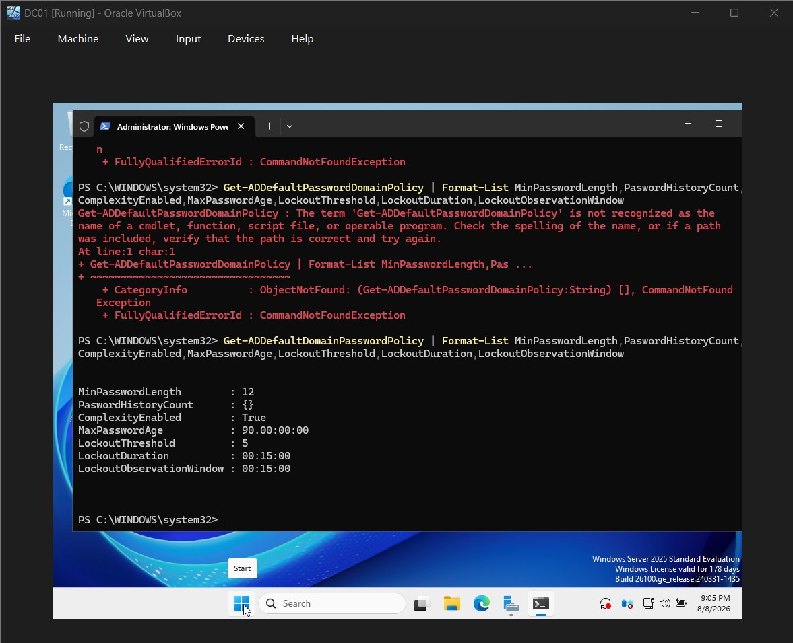

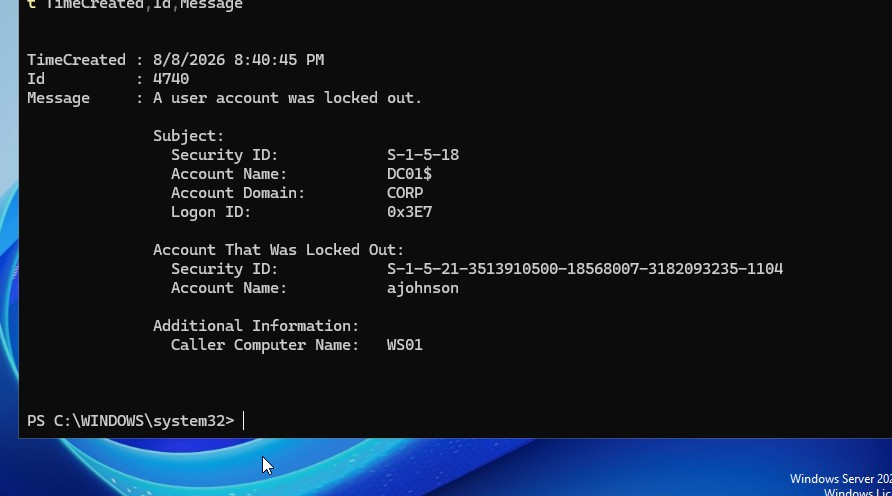

## Authorized Network and SMB Validation

An authorized Nmap service scan against `DC01` identified the expected DNS, Kerberos, RPC, LDAP, SMB, and Global Catalog services. SMB security validation reported that message signing was enabled and required.

```bash
sudo nmap -sV 192.168.56.5
sudo nmap -p 445 --script smb2-security-mode,smb2-time 192.168.56.5
```

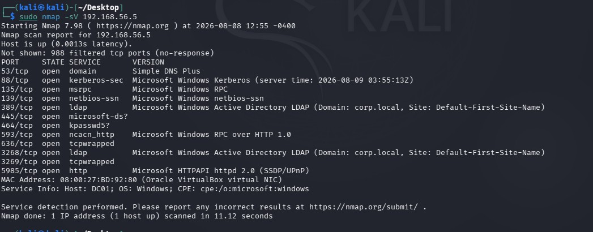

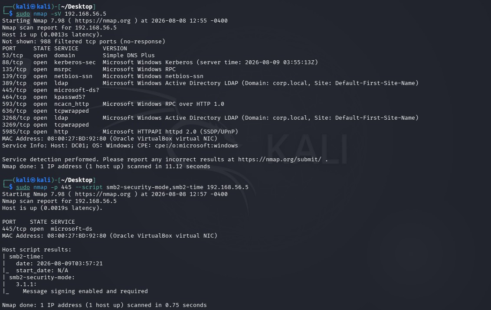

## Centralized Splunk Logging

Splunk Enterprise was deployed on `SPLUNK01`. Splunk Universal Forwarder was configured on the Windows hosts to send telemetry to the receiver on TCP port `9997`.

Centralized collection was verified for Windows Application, Security, and System logs from `DC01` and `WS01`.

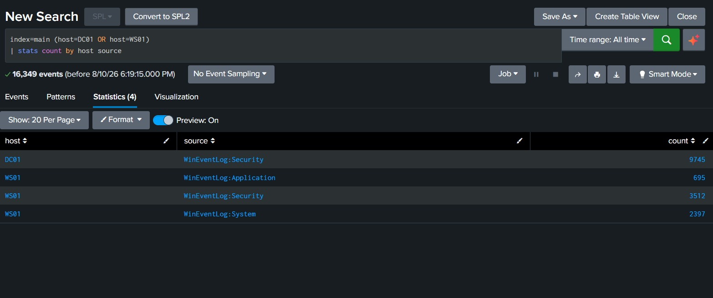

## Sysmon Telemetry

Sysmon was installed and verified on `WS01`. Its operational event channel was added to the Universal Forwarder input configuration.

The forwarder service account, `NT SERVICE\SplunkForwarder`, was added to the local **Event Log Readers** group so it could read the Sysmon channel.

Splunk then received thousands of centralized Sysmon records across multiple event IDs, including Event ID `1` process-creation telemetry.

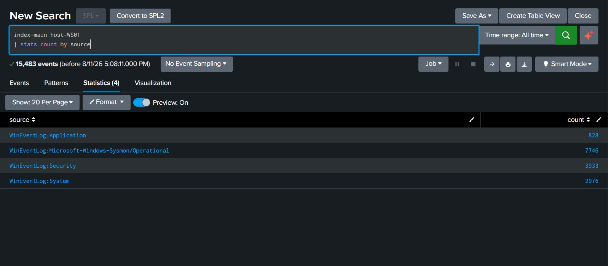

## Audit Policy and Controlled Tests

The following audit subcategories were enabled for success and failure where supported:

- User Account Management
- Security Group Management
- Process Creation
- Other Object Access Events

PowerShell script-block and module logging were also enabled. Harmless test objects were created and removed to generate auditable activity:

- Local test-user creation and deletion — Event IDs `4720` and `4726`
- Scheduled-task creation and deletion — Event IDs `4698` and `4699`
- Windows service installation — Event ID `7045`
- PowerShell process execution through Sysmon — Event ID `1`

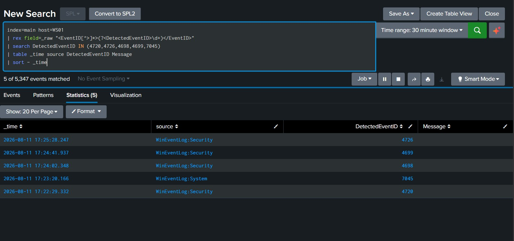

## Detection Engineering

The following reusable Splunk reports were created and validated:

| Detection report | Primary telemetry | Purpose |
|---|---|---|
| PowerShell Process Execution | Sysmon Event ID `1` | Identifies PowerShell process creation on `WS01` |
| User Account Created or Deleted | Security Event IDs `4720`, `4726` | Detects local account lifecycle activity |
| Windows Service Installed | System Event ID `7045` | Detects the installation of a Windows service |
| Scheduled Task Created or Deleted | Security Event IDs `4698`, `4699` | Detects scheduled-task lifecycle activity |
| Failed Authentication Detection | Security Event IDs `4625`, `4776` | Identifies failed Windows authentication attempts |

Because the forwarded events used XML rendering, the searches used `rex` to extract `<EventID>` when Splunk did not automatically populate `EventCode`.

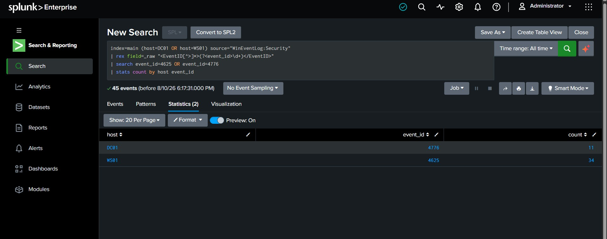

## Dashboard and Alerts

The security-monitoring dashboard contains panels for the four new detection reports alongside authentication monitoring.

Two scheduled alerts were enabled:

- Failed-authentication alert
- Windows Service Installation Alert, evaluated hourly over the previous 60 minutes and recorded in Splunk Triggered Alerts

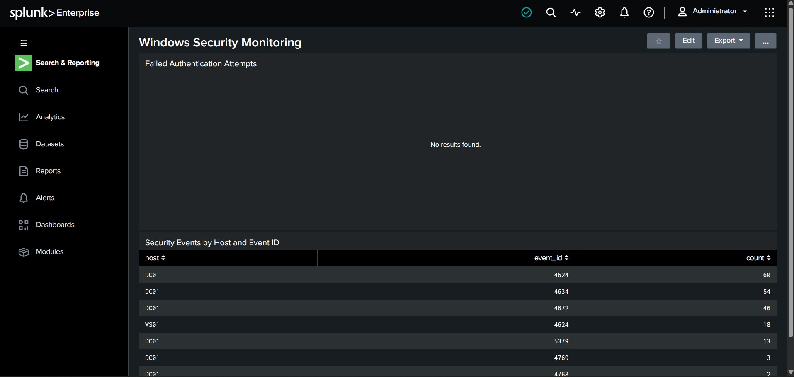

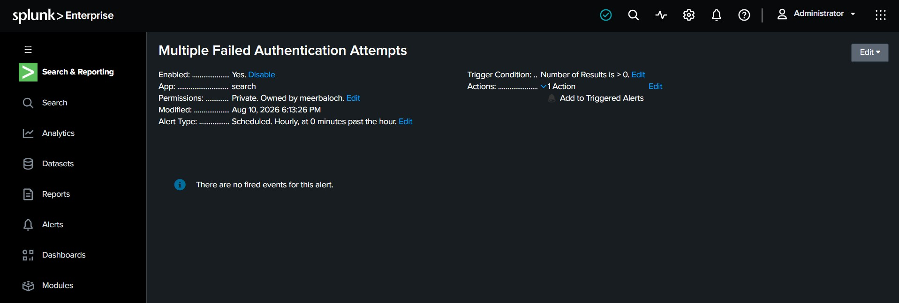

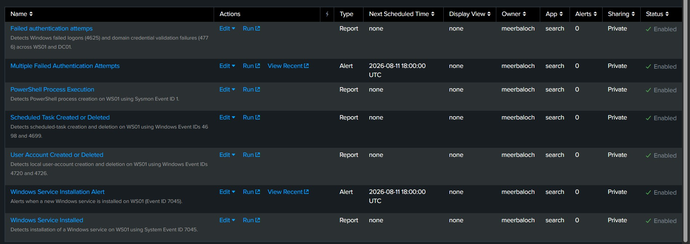

## Detection Considerations

These detections are intentionally broad for a small lab. In production, they should be tuned using host roles, approved administrator accounts, known automation, software-deployment tools, maintenance windows, command-line context, and historical baselines.

| Detection | Common legitimate causes | Recommended investigation |
|---|---|---|
| PowerShell execution | Administration, logon scripts, management agents | Review the user, parent process, command line, host, and related network activity |
| Account changes | Help-desk work, onboarding, test accounts | Validate the requester, target account, actor privileges, and nearby group changes |
| Service installation | Software installation, updates, endpoint tools | Review the service name, binary path, signer, installer process, and change ticket |
| Scheduled-task changes | Maintenance, backups, application updaters | Review the task action, trigger, author, execution account, and task path |
| Failed authentication | Mistyped passwords, stale credentials, mapped drives | Correlate the user, source host, frequency, lockouts, and successful logins |

## Validation Summary

| Validation | Result |
|---|---|
| Active Directory and DNS deployment | Passed |
| `WS01` domain enrollment and domain authentication | Passed |
| Password and account-lockout controls | Passed |
| Event ID `4740` lockout auditing | Passed |
| Authorized network reconnaissance | Passed |
| SMB signing required | Passed |
| Central collection from Windows hosts | Passed |
| Sysmon installation and centralized forwarding | Passed |
| Additional Windows audit policies | Passed |
| Five practical detection searches | Passed |
| Security dashboard panels | Passed |
| Two scheduled alerts enabled | Passed |

## Implementation Checklist

- [x] Build an isolated VirtualBox network
- [x] Deploy the `corp.local` Active Directory domain
- [x] Create domain users and organizational units
- [x] Join `WS01` to the domain and validate authentication
- [x] Test account lockout and examine Event ID `4740`
- [x] Enumerate domain-controller services and validate SMB signing
- [x] Deploy Splunk Enterprise and Universal Forwarders
- [x] Forward Windows logs from `DC01` and `WS01`
- [x] Install, configure, and centrally forward Sysmon
- [x] Enable additional audit and PowerShell logging policies
- [x] Perform controlled security simulations
- [x] Create and test detection reports
- [x] Add detection panels to the dashboard
- [x] Configure and verify scheduled alerts
- [x] Capture and organize evidence

## Limitations and Future Improvements

- VirtualBox time synchronization caused inconsistent timestamps during some earlier tests. Production systems should use a reliable time source and the Active Directory time hierarchy.
- The lab uses one monitored workstation and a small dataset. A production deployment would require tuning and baselining across more hosts.
- Future work could add privileged-group-change detection, suspicious parent-child process analytics, network telemetry, email or webhook alert actions, and formal incident-response playbooks.
- Additional test hosts could support lateral-movement and cross-host correlation scenarios.

## Repository Structure

```text
project-01-enterprise-ad-detection-lab/
├── configs/                Splunk, Sysmon, and Windows configuration files
├── detections/             SPL searches and detection documentation
├── docs/                   Architecture and investigation notes
├── evidence/               Sanitized screenshots and validation evidence
├── scripts/                Safe lab automation scripts
└── README.md               Project overview and results
```

## Skills Demonstrated

- Active Directory Domain Services and DNS administration
- Windows domain enrollment and identity management
- Windows Security event analysis and audit-policy configuration
- Sysmon deployment and troubleshooting
- Splunk Enterprise and Universal Forwarder configuration
- SPL search development and XML field extraction
- Detection engineering, dashboards, reports, and scheduled alerts
- PowerShell administration
- Nmap reconnaissance and SMB security validation
- False-positive analysis and incident-investigation planning
- Security evidence collection and technical documentation

## Ethical Use Statement

All security checks documented in this project were performed against systems created and owned by the project author in an isolated virtual lab. These techniques and tools should only be used on systems for which explicit authorization has been granted.

## Conclusion

This project successfully built and validated an end-to-end Active Directory detection lab. The environment combines domain services, a monitored Windows endpoint, centralized Windows and Sysmon telemetry, tested Splunk detections, a security dashboard, and scheduled alerts.

The final result demonstrates the full defensive workflow: configure telemetry, generate controlled activity, investigate raw events, build reusable searches, visualize findings, trigger alerts, and document operational considerations.
